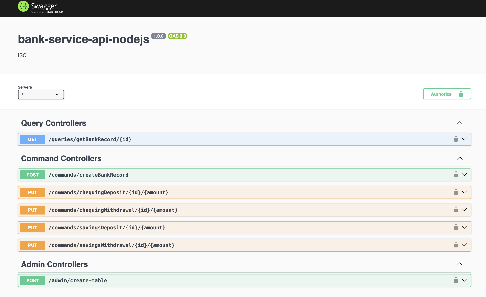

# Bank Service API

This is a CQRS (Command Query Responsibility Segregation) and Event Sourcing API that allows users to:

- Create a banking profile
- Deposit or withdraw from savings and chequing accounts

The API demonstrates read/write separation and allows separation of concerns between the read and write models, allowing for better scalability and performance. In addition, events versioning is implemented to allow for backward compatibility and records keeping.

## Technologies
- Node.js
- Express.js
- DynamoDB NoSql

## Installation
Download or clone the repository and run the following commands to start local development:

npm run docs

npm run start

